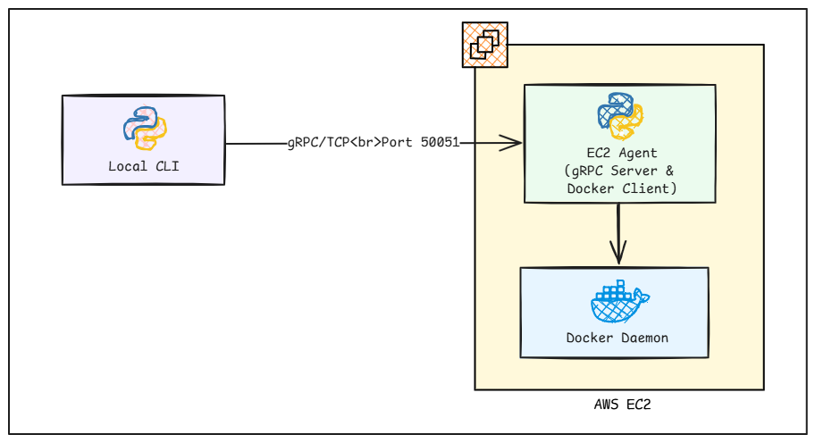
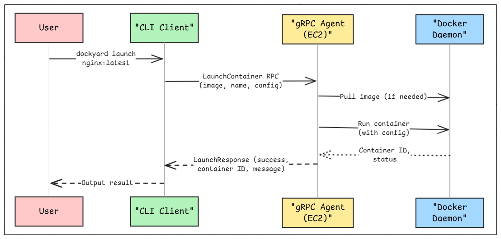

# Docker Container Launch on EC2

## Introduction

Welcome to Dockyard Lab 01! This lab introduces you to building a distributed container orchestration system using Python, gRPC, and Docker. You'll create a lightweight alternative to Docker Compose that can launch containers remotely on EC2 instances.

**What You'll Build:**
- A gRPC-based agent that runs on EC2 and manages Docker containers
- A CLI client that connects to the agent remotely to launch containers
- Support for launching containers with custom names and YAML configurations

**Learning Objectives:**
- Understand gRPC service design and implementation
- Learn Python-based Docker container management
- Build distributed systems with client-server architecture
- Practice deployment on AWS EC2

## Architecture

### System Overview

#### High-Level System Architecture



#### Component Interaction Diagram




### Components

#### 1. gRPC Service (`proto/dockyard.proto`)
- **Service**: `DockyardService`
- **RPC Method**: `LaunchContainer`
- **Request**: Image name, container name, config file path
- **Response**: Success status, container ID, message

#### 2. Agent Server (`agent/main.py`)
- Runs on EC2 instance
- Listens on port 50051
- Manages Docker containers using Python Docker SDK
- Supports YAML configuration files

#### 3. CLI Client (`cli/main.py`)
- Runs locally or remotely
- Connects to agent via gRPC
- Provides user-friendly commands
- Built with Click framework

## Task Description

In this lab, you'll implement basic container launch functionality:

### Core Features
1. **Basic Launch**: Launch containers by image name
   ```bash
   dockyard launch nginx:latest
   ```

2. **Named Containers**: Launch with custom container names
   ```bash
   dockyard launch redis:alpine --name cache
   ```

3. **Configuration Files**: Launch using YAML config files
   ```bash
   dockyard launch -f app.yaml
   ```

### YAML Configuration Format
```yaml
image: nginx:latest
name: web-server
environment:
  - "ENV=production"
  - "DEBUG=false"
ports:
  80/tcp: 8080
volumes:
  - "/tmp:/app/tmp"
```

## Step-by-Step Setup Guide

### Prerequisites
- Python 3.8+ installed
- Docker installed on EC2 instance
- AWS EC2 instance with Docker configured
- SSH access to EC2 instance

### 1. Clone and Setup Repository

```bash
# Clone the repository
git clone https://github.com/poridhioss/dockyard.git
cd dockyard

# Switch to lab-01 branch
git checkout lab-01

# Install development dependencies (for proto generation)
make install-dev
make install-

# Generate gRPC code from proto files
make proto
```

### 2. EC2 Instance Setup

```bash
# SSH into your EC2 instance
ssh -i your-key.pem ubuntu@<ec2-ip-address>

# Install Docker (if not already installed)
sudo apt update
sudo apt install -y docker.io python3-venv
sudo systemctl start docker
sudo systemctl enable docker

# Add user to docker group
sudo usermod -aG docker ubuntu
newgrp docker

# Verify Docker is working
docker --version
docker ps
```

### 3. Deploy Agent to EC2

```bash
# Copy project files to EC2
scp -r -i your-key.pem agent/ proto/ dockyard_pb2.py dockyard_pb2_grpc.py ubuntu@<ec2-ip>:~/

# SSH into EC2 and setup
ssh -i your-key.pem ubuntu@<ec2-ip>

# Create virtual environment for agent
python3 -m venv agent_venv
source agent_venv/bin/activate

# Install agent dependencies
pip install -r agent/requirements.txt

# Generate gRPC code (if needed)
python3 -m grpc_tools.protoc -I./proto --python_out=. --grpc_python_out=. proto/dockyard.proto

# Start the agent
python3 agent/main.py
# Or run in background:
nohup python3 agent/main.py > agent.log 2>&1 &
```

### 4. Test from Local Machine

```bash
# Create local virtual environment
python3 -m venv venv
source venv/bin/activate  # Linux/Mac
# or
venv\Scripts\activate  # Windows

# Install CLI dependencies
pip install -r cli/requirements.txt

# Generate gRPC code locally
python3 -m grpc_tools.protoc -I./proto --python_out=. --grpc_python_out=. proto/dockyard.proto

# Test basic launch
python3 cli/main.py --host <ec2-ip> launch nginx:latest

# Test with custom name
python3 cli/main.py --host <ec2-ip> launch redis:alpine --name cache

# Test with YAML config
python3 cli/main.py --host <ec2-ip> launch -f labs/lab1-launch/app.yaml

# Verify containers on EC2
ssh -i your-key.pem ubuntu@<ec2-ip> "docker ps"
```

## Code Files and Implementation

### 1. Protocol Buffer Definition (`proto/dockyard.proto`)

**Purpose**: Defines the gRPC service contract

**Key Elements**:
- `DockyardService`: Main service interface
- `LaunchContainer`: RPC method for launching containers
- `LaunchRequest`: Contains image, name, and config file parameters
- `LaunchResponse`: Returns success status and container details

```protobuf
service DockyardService {
    rpc LaunchContainer(LaunchRequest) returns (LaunchResponse);
}

message LaunchRequest {
    string image = 1;        // Docker image name
    string name = 2;         // Container name (optional)
    string config_file = 3;  // YAML config path (optional)
}
```

### 2. Agent Server (`agent/main.py`)

**Purpose**: gRPC server that manages Docker containers

**Key Components**:

#### DockyardServicer Class
- Implements the gRPC service interface
- Manages Docker client connection
- Handles container lifecycle operations

#### Docker Integration
```python
# Connect to Docker daemon
self.docker_client = docker.from_env()

# Pull image if not exists
self.docker_client.images.pull(image)

# Launch container
container = self.docker_client.containers.run(
    image=image,
    name=name,
    detach=True,
    **container_args
)
```

#### YAML Configuration Parsing
- Reads YAML files for container configuration
- Supports environment variables, port mappings, volumes
- Merges CLI arguments with config file settings

#### Error Handling
- Docker API errors
- Missing images or config files
- Network connectivity issues

### 3. CLI Client (`cli/main.py`)

**Purpose**: User-friendly command-line interface

**Key Components**:

#### Click Framework Integration
```python
@click.group()
@click.option('--host', default='localhost')
@click.option('--port', default=50051)
def cli(ctx, host, port):
    """Dockyard - Container orchestration CLI"""
```

#### DockyardClient Class
- Manages gRPC channel and stub
- Handles connection to remote agent
- Provides high-level container operations

#### Command Implementation
```python
@cli.command()
@click.argument('image', required=False)
@click.option('--name', '-n', help='Container name')
@click.option('-f', '--file', 'config_file', help='YAML config file')
def launch(ctx, image, name, config_file):
    # Launch container logic
```

### 4. Configuration Management

#### Requirements (`requirements.txt`)
- **grpcio/grpcio-tools**: gRPC framework
- **docker**: Python Docker SDK
- **click**: CLI framework
- **pyyaml**: YAML configuration support
- **protobuf**: Protocol buffer support

#### Build Automation (`Makefile`)
```makefile
proto:
    python -m grpc_tools.protoc -I./proto --python_out=. --grpc_python_out=. proto/dockyard.proto

install:
    pip install -r requirements.txt

run-agent:
    python agent/main.py
```

## Testing and Validation

### 1. Unit Testing
```bash
# Test CLI help
python3 cli/main.py --help
python3 cli/main.py launch --help

# Test agent startup (should show "Agent started on port 50051")
python3 agent/main.py
```

### 2. Integration Testing
```bash
# Test end-to-end launch
python3 cli/main.py --host <ec2-ip> launch nginx:latest --name test

# Verify container is running
ssh -i key.pem ubuntu@<ec2-ip> "docker ps | grep test"

# Test YAML configuration
python3 cli/main.py --host <ec2-ip> launch -f labs/lab1-launch/app.yaml
```

### 3. Troubleshooting Common Issues

#### Agent Connection Errors
- Check if agent is running on EC2
- Verify port 50051 is accessible
- Check security group settings

#### Docker Permission Errors
```bash
# Fix Docker permissions
sudo usermod -aG docker $USER
newgrp docker
```

#### gRPC Import Errors
```bash
# Regenerate proto files
make proto
```

## Next Steps

After completing Lab 01, you'll be ready for:
- **Lab 02**: Container stop functionality
- **Lab 03**: Execute commands in containers
- **Lab 04**: View container logs
- **Lab 05**: Advanced features (list, inspect, networking)

## Key Takeaways

1. **gRPC Architecture**: Learn how to design and implement distributed services
2. **Docker Integration**: Understand container management via Python SDK
3. **Configuration Management**: Support multiple input formats (CLI args, YAML)
4. **Error Handling**: Robust error handling in distributed systems
5. **CLI Design**: Build user-friendly command-line interfaces

